# 01. Arquitectura y Funcionamiento General del ERP Actual (iPN)

## 1. Visión General del Sistema
El sistema actual utilizado es **iPN ERP Cloud SaaS** (desarrollado por *infiniteLoop S.A.*, versión 2.4.x). Es una plataforma de gestión integral orientada a la industria del calzado, indumentaria, marroquinería y retail mayorista/minorista.

---

## 2. Arquitectura de Sesión y Acceso
- **URL Base**: `https://app.ipn.com.ar/`
- **Mecanismo de Autenticación**:
  - Endpoint de autenticación: `POST /login.asp`
  - Parámetros: `userName`, `password`, `browserName`, `browserVersion`, `browserLongName`, `doAction=1`.
  - Tokens de Seguridad: Genera cookies HTTP-only (`iPN.userID`, `iPN.IL_CustomerID`, `iPN.userGUID`, `iPN.secretToken`, `ASPSESSIONID...`).
  - Intercepción de Notificaciones: Tras el login, el sistema valida avisos del sistema en `/notifications.asp` antes de habilitar el panel operativo (`doAction=1`, `notificationID`).
- **Nivel de Cuenta y Roles**:
  - `IL_CustomerID`: Identificador del cliente / tenant en la nube (ID: `310`).
  - `userID`: Identificador del usuario autenticado (ID: `7711` - `46792-juli`, Administrador de cuenta).

---

## 3. Estructura Multi-Empresa (Razones Sociales)
El ERP opera bajo un esquema multi-empresa donde un mismo usuario puede gestionar diferentes razones sociales con configuración impositiva, sucursales y puntos de venta independientes:

| ID | Razón Social | CUIT | Condición Fiscal | Cant. Sucursales / Locales |
| :--- | :--- | :--- | :--- | :--- |
| **1** | **DANIEL ALEJANDRO GRASSO** | `20-26038216-1` | IVA Responsable Inscripto | 7 Sucursales / Depósitos |
| **2** | **GATICAR** | `30-71257700-9` | IVA Responsable Inscripto | 2 Sucursales / Depósitos |

### Selección y Conmutación de Contexto Operativo:
- Endpoint: `POST /defaultSelectedCompany.asp`
- Setea las variables de sesión: `companyID`, `companyName`, `storeID`, `storeTypeID`.

---

## 4. Mapa de Módulos Funcionales
El sistema se divide en 7 grandes áreas operativas interconectadas:

```mermaid
graph TD
    A[ERP Core iPN] --> B[1. Catálogo y Artículos]
    A --> C[2. Stock y Depósitos]
    A --> D[3. Ventas y Clientes]
    A --> E[4. Compras y Proveedores]
    A --> F[5. Producción y Talleres]
    A --> G[6. Canales Digitales y Conexiones]
    A --> H[7. Fiscal y Contabilidad AFIP]

    B --> B1[Matriz Talle / Color]
    B --> B2[Listas de Precios Automáticas]
    B --> B3[Temporadas y Marcas]

    C --> C1[Stock Disponible por Sucursal]
    C --> C2[Reservas y Compromisos]
    C --> C3[Transferencias y Auditoría Colector]

    D --> D1[Punto de Venta / Caja POS]
    D --> D2[Cuentas Corrientes Clientes]
    D --> D3[Preventas y Pedidos Mayoristas]

    E --> E1[Órdenes de Compra]
    E --> E2[Remitos y Cuentas Proveedores]

    F --> F1[Fichas Técnicas Calzado]
    F --> F2[Órdenes de Producción OP]
    F --> F3[Operarios y Liquidación de Haberes]

    G --> G1[Portal B2B Mayorista SkyBlue]
    G --> G2[Mercado Libre MLA]
    G --> G3[Tiendanube TDN]
    G --> G4[Mercado Pago QR / Webhook]

    H --> H1[Facturación Electrónica AFIP]
    H --> H2[Libro IVA Digital / SIAP / TXT]
    H --> H3[Retenciones y Percepciones ARBA/AGIP]
```

---

## 5. Puntos Fuertes y Limitaciones del ERP Actual

### Puntos Fuertes:
1. **Lógica de negocio especializada en calzado**: Manejo nativo de matrices de talles por bulto/curva, colores, materiales y temporadas.
2. **Cálculo automatizado de márgenes y listas de precios**: Derivación automática de 10 listas de precios a partir del costo base.
3. **Módulo de producción y talleres**: Fichas técnicas, desglose de materias primas y liquidación por par a operarios/talleres.

### Limitaciones Identificadas (Motivos para el ERP Propio):
1. **Tecnología Legada (ASP Clásico / Render Server-Side)**: Interfaces lentas, recargas completas de página, alta dependencia de sesiones de servidor no REST.
2. **Falta de API moderna abierta**: No ofrece endpoints GraphQL o REST OpenAPI para sincronización instantánea y reactiva con la web moderna.
3. **Silos de Información y Duplicación**: La sincronización con la web mayorista depende de procesos batch o scrapers en lugar de una base de datos centralizada con webhooks en tiempo real.
4. **Restricciones de Personalización UI/UX**: No permite crear flujos de preventa dinámicos, catálogos interactivos 3D/video, ni dashboards analíticos personalizados con IA.
