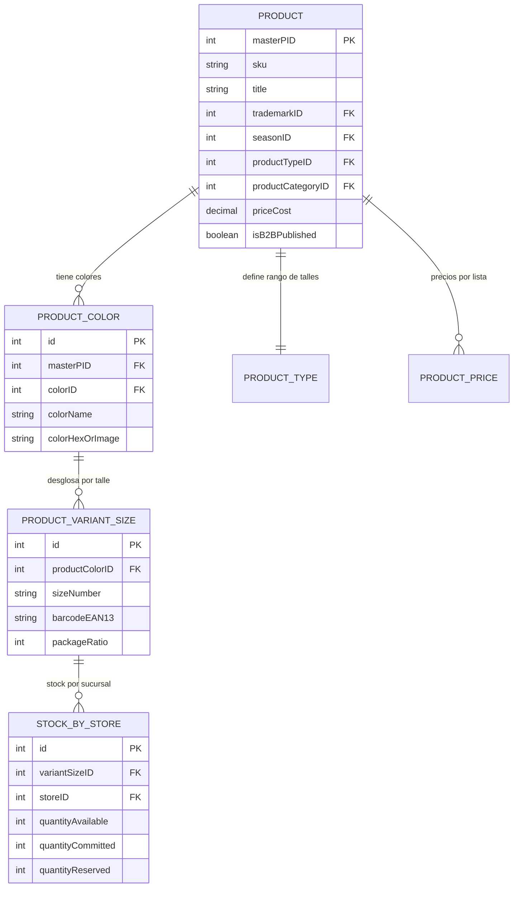

# 02. Modelo de Datos, Artículos, Temporadas y Catálogo

## 1. Entidad Principal de Producto (Artículos)
En el ERP, un artículo representa el modelo base de calzado o accesorio.

### Estructura de Atributos del Artículo:
| Campo Técnico | Tipo | Descripción | Ejemplo |
| :--- | :--- | :--- | :--- |
| `masterPID` / `productID` | INT (PK) | Identificador único del modelo | `10452` |
| `productDesc` | VARCHAR(50) | Código de artículo / Modelo | `8326-SANDALIA` |
| `description` | TEXT | Descripción comercial y detalles | `Sandalia taco medio con pulsera...` |
| `trademarkID` | INT (FK) | Marca | `PETITE JOLIE`, `REFRESH`, `XTI BY SKY BLUE` |
| `seasonID` | INT (FK) | Temporada comercial | `Verano 2026`, `Invierno 2026` |
| `productTypeID` | INT (FK) | Tipo / Curva de producto | `Calzado Dama (35-40)`, `Calzado (35-42)` |
| `productCategoryID` | INT (FK) | Categoría / Rubro | `SANDALIAS`, `BOTAS`, `ZAPATILLAS` |
| `materialID` | INT (FK) | Material principal | `PU Cuero Sintético`, `Goma EVA`, `Cuero Vacuno` |
| `lineID` | INT (FK) | Línea de producto | `Línea Premium`, `Línea Urban` |
| `providerID` | INT (FK) | Proveedor / Fabricante de origen | Proveedor asociado |
| `priceCost` | DECIMAL(18,2)| Costo base de adquisición / fabricación | `15400.00` |
| `IVApercent` | DECIMAL(5,2) | Tasa de alícuota IVA | `21.00%` / `10.50%` |
| `IVAActivityTypeID`| INT (FK) | Tipo de actividad impositiva AFIP | `1: Bienes (excepto bienes de uso)` |
| `isB2BPublished` | BOOLEAN (1/0)| Visibilidad activa en portal mayorista B2B| `1` |
| `isFeaturedProduct`| BOOLEAN (1/0)| Destacado en home / portal | `1` |
| `mainImage` / `images` | ARRAY/URL | Fotos del artículo (frontal, lateral, etc.) | `https://.../img.jpg` |

---

## 2. Matriz de Variantes: Talles y Colores (Estructura de Curvas)
La lógica de calzado exige una matriz bidimensional: **(Artículo) x (Color) x (Talles)**.

### Curvas de Talles Configuradas en el Sistema:
El ERP define 33 rangos de talles estandarizados según el segmento:
- **Calzado Dama (35-40)**: Talles `35, 36, 37, 38, 39, 40` (6 talles).
- **Calzado Dama (35-41)**: Talles `35, 36, 37, 38, 39, 40, 41` (7 talles).
- **Calzado Hombre (39/44)**: Talles `39, 40, 41, 42, 43, 44` (6 talles).
- **Calzado de Niños (21/36)**: Talles dobles `21/22, 23/24, 25/26, 27/28, 29/30, 31/32, 33/34, 35/36`.
- **Accesorios / Cinturones**: `85, 90, 95, 100, 105, 110` o `Único`.

---

## 3. Listas de Precios y Reglas de Rentabilidad
El sistema opera con **10 listas de precios dinámicas**, calculadas automáticamente aplicando coeficientes porcentuales sobre el `priceCost` (Costo Base):

| ID | Nombre de Lista | Descripción de Uso | Recargo por Defecto | Moneda |
| :--- | :--- | :--- | :--- | :--- |
| **1** | **Público** | Precio de venta minorista en locales / POS | `+100.00%` | ARS ($) |
| **2** | **Mayorista** | Precio base venta mayorista showroom | `+50.00%` | ARS ($) |
| **3** | **Lista** | Precio de lista general | `+50.00%` | ARS ($) |
| **4** | **Venta a locales** | Transferencias / Consignación sucursales | `+25.00%` | ARS ($) |
| **5** | **Venta a outlets** | Precio especial liquidación outlet | `+15.00%` | ARS ($) |
| **6** | **Venta a franquicias** | Precio franquicias autorizadas | `+35.00%` | ARS ($) |
| **7** | **Venta minorista en outlet** | Precio mostrador locales outlet | `+80.00%` | ARS ($) |
| **8** | **Venta a clientes 2** | Precio cuenta corriente especial | `+60.00%` | ARS ($) |
| **9** | **ML CLASSIC** | Publicaciones Mercado Libre (incluye comisiones) | `+150.00%` | ARS ($) |
| **10**| **Venta B2C en dólares** | E-commerce internacional / Exportación | `+100.00%` | USD (U$S) |

### Fórmula de Cálculo:
$$\text{Precio Final} = \text{Costo Base} \times \left(1 + \frac{\text{\% Recargo}}{100}\right) \times \text{Factor Conversión Moneda}$$

---

## 4. Modalidades de Venta y Paquetes de Bulto (Venta Mayorista)
En el portal B2B y ERP, los artículos se venden bajo 2 esquemas:
1. **Venta por Bulto Cerrado / Curva Estándar**: Por ejemplo, bulto de 12 pares (distribución: 1x35, 2x36, 3x37, 3x38, 2x39, 1x40).
2. **Venta por Unidad / Par Suelto**: Selección libre de color y talle por pedido mínimo.
