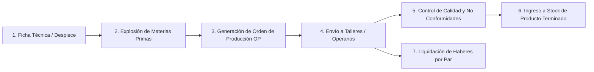

# 05. Módulo de Producción, Fichas Técnicas y Talleres

## 1. El Ciclo de Fabricación de Calzado en el ERP
El ERP incluye un submódulo de MRP/Producción adaptado específicamente a las etapas de confección de calzado:

---

## 2. Fichas Técnicas de Producto (`/production/preProducts/`)
La ficha técnica define la receta exacta para fabricar un par de calzado:
- **Estructura del Despiece**:
  - **Corte / Capellada**: Metros cuadrados de cuero o PU, forro interno.
  - **Fondo / Base**: Tipo de suela (goma TR, PVC, EVA, PU), taco, vira.
  - **Plantilla y Confort**: Espesores, densidad de espuma, badana.
  - **Avíos y Accesorios**: Hebillas, cierres, ojalillos, cordones, elásticos, remaches.
  - **Insumos Químicos**: Adhesivos de contacto, pegamentos PU, reactivadores, tinturas.
  - **Packaging**: Caja individual de calzado, papel seda, bolsita protectora, etiquetas EAN13.

---

## 3. Materias Primas e Inventario de Insumos (`/production/rawMaterial/`)
- Control de stock de materias primas en diferentes unidades de medida (metros lineales, $\text{m}^2$, kilogramos, pares, docenas, unidades).
- Cálculo automático de punto de reorden y pedidos a proveedores de curtientes y suelas.
- **Movimientos de Materia Prima (`/production/rawMaterialMovement/`)**: Descuento de stock en el momento en que se emite la Orden de Producción.

---

## 4. Órdenes de Producción (OP) (`/production/tickets/`)
- Lanzamiento de órdenes de corte y confección por lote de curvas de talles (ej: 500 pares de Sandalia mod. 8326 distribuidos en curvas).
- Seguimiento de estados: *Planificada $\rightarrow$ En Corte $\rightarrow$ En Taller de Aparado $\rightarrow$ En Montaje $\rightarrow$ En Empaque $\rightarrow$ Terminada*.
- **Control de No Conformidades (`/production/productionErrorsTypes/`)**: Registro de fallas de fábrica o segundas para desvío a outlet.

---

## 5. Operarios, Talleres y Liquidación a Destajo
- **Talleres Externos (`/production/workshop/default.asp`)**: Gestión de talleres tercerizados (aparadores, armadores, cortadores) y control de mercadería en poder de terceros.
- **Liquidación de Haberes por Rendimiento (`/production/incomeSettlement/default.asp`)**:
  - Pago por unidad producida (tarifa por par completado según la etapa y complejidad del modelo).
  - Emisión de planillas y recibos de liquidación para talleres y operarios de planta.
