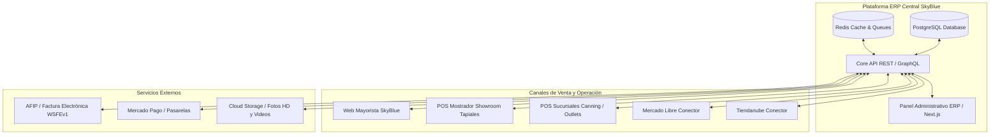
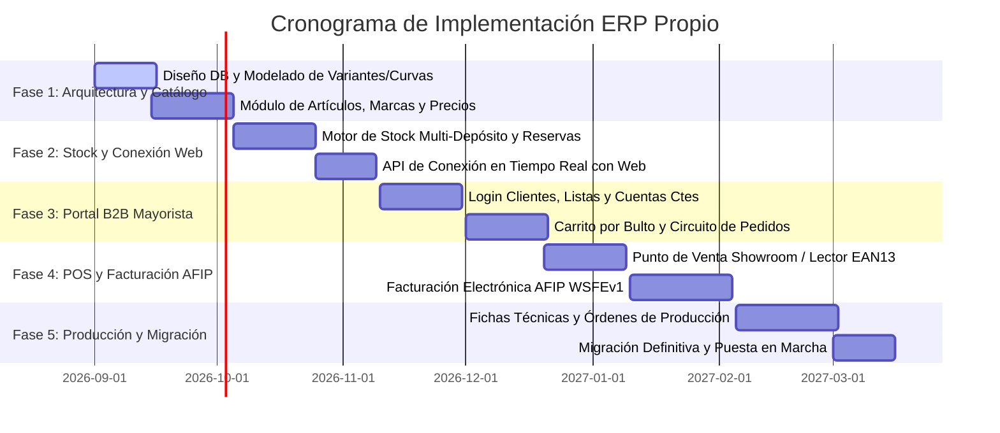

# 07. Plan de Desarrollo y Blueprint de la Plataforma ERP Propia

## 1. Visión y Objetivo Estratégico
El objetivo es construir una **plataforma ERP moderna, centralizada y 100% propia para SkyBlue**, eliminando costos de licenciamiento externos, modernizando la tecnología y logrando una **integración nativa y en tiempo real con la web mayorista (Showroom B2B y B2C)**.

---

## 2. Stack Tecnológico Recomendado
Para garantizar máxima velocidad, robustez y escalabilidad:

- **Backend / API**: **Node.js (TypeScript) con NestJS o Express / Fastify**.
  - Arquitectura modular basada en microservicios o monolito modular (DDD - Domain Driven Design).
  - Webhooks y WebSockets para sincronización de stock y precios instantáneos en la web.
- **Base de Datos**: **PostgreSQL 16+**.
  - Manejo relacional estricto para stock, transacciones financieras y facturación.
  - Columnas `JSONB` para atributos dinámicos de producto (especificaciones de ficha técnica).
- **Caché y Colas de Tareas**: **Redis + BullMQ**.
  - Para sincronización asíncrona de pedidos, alertas de stock mínimo y colas de facturación AFIP.
- **Frontend Panel Administrativo**: **Next.js 15 (React 19) + Tailwind CSS + Shadcn UI**.
  - Experiencia de usuario ultra rápida tipo SPA (Single Page Application) sin recargas de página.
  - Soporte offline / PWA para el punto de venta de mostrador en caso de caídas de internet.
- **Almacenamiento de Multimedia**: **Cloudflare R2 o AWS S3**.
  - CDN de ultra baja latencia para fotos de calzado en alta definición, videos de reels y fichas técnicas.

---

## 3. Hoja de Ruta de Desarrollo por Fases

### Detalle de Fases:

### **Fase 1: Base de Datos Central y Catálogo de Artículos**
1. Implementar el modelo relacional: Artículos, Curvas de Talles, Colores, Marcas, Temporadas y Categorías.
2. Motor de cálculo de precios automático: Derivación de las 10 listas de precios a partir del costo base con márgenes configurables.
3. Generador y lector de códigos de barra EAN13 por SKU (Variante).

### **Fase 2: Motor de Stock y Conexión Nativa con la Web de SkyBlue**
1. Control multi-sucursal (Depósito Central, Showroom Tapiales, Canning, Outlets).
2. Lógica de 3 estados de stock (*Físico, Comprometido, Disponible*).
3. **Conexión Directa con la Web**:
   - Endpoint `/api/v1/products/public` para que la web consuma productos activos con un toggle `is_published_web = true`.
   - Webhooks en tiempo real: Si se vende un par en el Showroom, se actualiza el stock en la web en menos de 100 milisegundos.

### **Fase 3: Portal B2B Mayorista Integrado y Clientes**
1. Módulo de clientes mayoristas: CUIT, Vendedor asignado, Lista de precios asignada y Límite de crédito en cuenta corriente.
2. Carrito de compra inteligente para mayoristas:
   - Selección por Bultos Cerrados / Curvas o Pares Sueltos.
   - Cálculo automático de descuentos por volumen y formas de pago.
3. Bandeja de Pedidos Abiertos y tracking de armado en depósito.

### **Fase 4: Punto de Venta (POS Mostrador) y Facturación AFIP**
1. Interfaz táctil y rápida para los vendedores del Showroom de Tapiales y sucursales.
2. Integración con pistolas lectoras de códigos de barra y terminales de cobro.
3. Módulo de Facturación Electrónica AFIP (WSFEv1):
   - Emisión instantánea de Facturas A/B y Notas de Crédito con CAE y código QR fiscal.
   - Generación de archivos TXT para Libro IVA Digital y regímenes ARBA/AGIP.

### **Fase 5: Módulo de Producción (MRP) y Fichas Técnicas**
1. Carga de Fichas Técnicas de calzado (despiece de capellada, fondos, forros, avíos).
2. Órdenes de Producción (OP) con explosión automática de materias primas.
3. Módulo de operarios y talleres externos con liquidación de haberes por par producido.

---

## 4. Estrategia de Migración sin Interrupción Operativa
Contamos con los scripts automáticos desarrollados para:
1. **Extracción en Frío**: Descargar todos los artículos, curvas de talles, marcas, temporadas, precios y fotos del ERP actual a formato JSON/CSV estructurado.
2. **Normalización y Limpieza**: Corregir inconsistencias de nombres, códigos duplicados o talles obsoletos.
3. **Carga Inicial (Seeding)**: Poblar la nueva base de datos PostgreSQL de la plataforma propia.
4. **Período de Paralelo / Shadow Run**: Ejecutar el nuevo sistema en paralelo durante 1 o 2 semanas hasta el *Go-Live* definitivo.

---

## 5. Beneficios de la Solución Propia
- **Control Total del Negocio**: Sin restricciones de funcionalidades ni costos mensuales por usuario o sucursal.
- **Sincronización Web 100% Integrada**: Un solo sistema para todo el negocio; si un producto se crea en el ERP, se publica en la web de inmediato.
- **Velocidad y Modernidad**: Consultas en milisegundos, interfaz moderna adaptada a celulares y tablets para los vendedores del Showroom.
