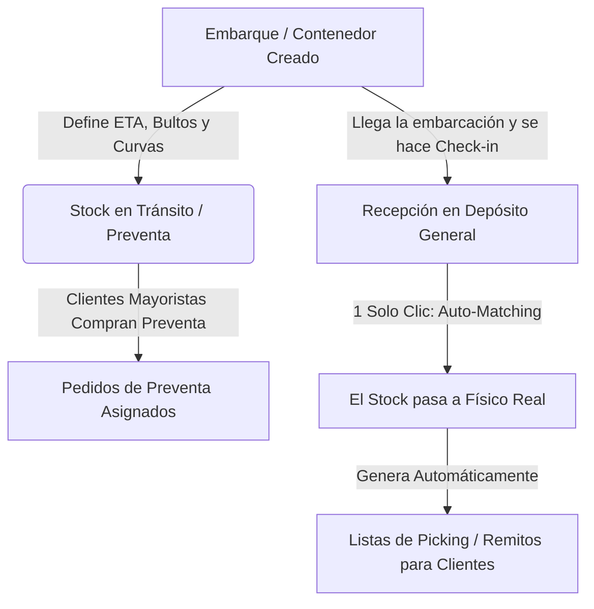

# 08. Mejoras Operativas, Fluidez y Solución de Stock en Tránsito / Importaciones

## 1. El Problema Crítico Actual en iPN y Cómo lo Resolvemos

### Diagnóstico del Problema:
En el sistema actual, para poder tomar preventas y hacer reservas a clientes mayoristas sobre mercadería que viene en viaje, se ven obligados a cargar la mercadería en camino como si ya estuviese físicamente en el depósito.
- **Consecuencias negativas actuales**:
  1. Se mezcla el stock real disponible en estantería con el stock futuro en tránsito.
  2. El personal del depósito y del showroom no sabe con certeza si un par está para entrega inmediata o en un contenedor en altamar.
  3. No hay trazabilidad de qué embarque/contenedor contiene cada pedido reservado.
  4. Al llegar el barco/embarcación, hay que revisar manualmente qué pedidos estaban pendientes de esa mercadería.

---

## 2. Solución: Módulo de Embarques y Stock en Tránsito con Preventa Automática

En la nueva plataforma propia, se separa completamente el concepto de **Stock Físico Real** del **Stock en Tránsito / Importación**:



### Características del Módulo de Importaciones:
1. **Entidad de Embarque / Contenedor**:
   - Número de Contenedor / Despacho / BL.
   - Fecha Estimada de Arribo (ETA).
   - Detalle de artículos, colores y curvas cargadas.
2. **Visualización en Catálogo y Web**:
   - Los artículos muestran dos indicadores claros:
     - 🟢 **En Stock Inmediato**: `X pares listos para retirar hoy en Depósito General`.
     - 🔵 **Próximo Arribo (Preventa)**: `X pares en camino (Llegada estimada: 15/Septiembre)`.
3. **Auto-Match de Recepción**:
   - Cuando el contenedor llega al Depósito General, al presionar **"Confirmar Recepción de Embarque"**, el sistema automáticamente:
     - Convierte ese stock de "En tránsito" a "Físico Real".
     - Notifica a los vendedores qué pedidos mayoristas ya están listos para empaque y facturación.
     - Imprime las etiquetas de bulto con los nombres de los clientes asignados.

---

## 3. Topología de Sucursales y Canales de Venta

```
                           ┌────────────────────────────────────────────────────────┐
                           │               PLATAFORMA CENTRAL SKYBLUE               │
                           └───────────────────────────┬────────────────────────────┘
                                                       │
                       ┌───────────────────────────────┴───────────────────────────────┐
                       ▼                                                               ▼
        ┌─────────────────────────────┐                                 ┌─────────────────────────────┐
        │      DEPÓSITO GENERAL       │                                 │           OUTLET            │
        │    (Showroom Mayorista)     │                                 │ (Curapaligue 1428 Tapiales) │
        ├─────────────────────────────┤                                 ├─────────────────────────────┤
        │ • Venta Mayorista (B2B)     │                                 │ • Venta Minorista Mostrador │
        │ • Stock por Bulto y Curvas  │                                 │ • Stock Tienda Online (Web) │
        │ • Showroom con Vendedores   │                                 │ • Sincronización instantánea│
        │ • Recepción Importaciones   │                                 │ • Pares sueltos / Promos    │
        └─────────────────────────────┘                                 └─────────────────────────────┘
```

### A. Depósito General (Showroom Mayorista)
- **Foco**: Operación B2B, grandes volúmenes, curvas cerradas y bultos.
- **Modo Mostrador / Showroom**:
  - Los vendedores usan una tablet o celular con la app del ERP.
  - Al acompañar al cliente por el showroom, escanean los modelos y van armando el pedido mayorista en vivo.
  - El sistema valida instantáneamente si hay stock físico o si entra en preventa del próximo embarque.

### B. Outlet (Curapaligue 1428 - Tapiales)
- **Foco**: Venta al público en local comercial + Stock de la Tienda Online (Web).
- **Control de Stock Unificado Web / Local**:
  - Comparte el inventario del local con la web minorista.
  - **Bloqueo Inteligente de Stock (Anti-quiebre)**: Si un cliente en la web añade el último par al carrito e inicia el pago, ese par se bloquea temporalmente por 15 minutos para que no se venda en mostrador, y viceversa. Si el mostrador lo pasa por caja, se descuenta de la web en menos de 100 milisegundos.

---

## 4. Mejoras de Fluidez y Reducción Drástica de Pasos (UX Moderna)

| Proceso en iPN Actual | Problema en iPN | Solución en la Nueva Plataforma Propia |
| :--- | :--- | :--- |
| **Carga de Artículos** | 6 pantallas separadas, recargas lentas, selección manual de 10 listas de precios. | **Grilla Rápida en 1 Sola Pantalla**: Cargás el modelo, seleccionás colores y curvas en una matriz visual tipo Excel interactiva. Cargar 10 variantes lleva 45 segundos. |
| **Cálculo de Precios** | Cálculos manuales o propensos a error de listas. | **Cálculo Automático en Vivo**: Ingresás el costo base (en USD o ARS) y se calculan las 10 listas al instante según las reglas de margen. |
| **Búsqueda de Datos** | Filtros lentos, múltiples clics en dropdowns sin autocompletar. | **Buscador Global Inteligente (`Ctrl + K`)**: Buscás por código de artículo, nombre, cliente, CUIT, factura o color en 0.02 segundos desde cualquier parte del sistema. |
| **Seguimiento de Pedidos** | Tablas estáticas difíciles de filtrar. | **Tablero Visual Kanban (Flujo de Estados)**: Arrastrar pedidos entre columnas (*Nuevo $\rightarrow$ Aprobado $\rightarrow$ En Armado Depósito $\rightarrow$ Listo para Retiro/Envío $\rightarrow$ Facturado*). |
| **Comunicación con Clientes** | Descargar PDFs, abrir correos, adjuntar manualmente. | **Integración Nativa WhatsApp**: Botón de 1 clic para enviar el detalle del pedido, desglose de curvas, fotos y link de pago directo al WhatsApp del cliente mayorista. |
| **Control con Códigos de Barra** | Sistemas lentos que requieren terminales especiales. | **Escáner Integrado**: Funciona con lectores USB/Bluetooth y con la misma cámara de cualquier celular/tablet sin instalar software adicional. |
