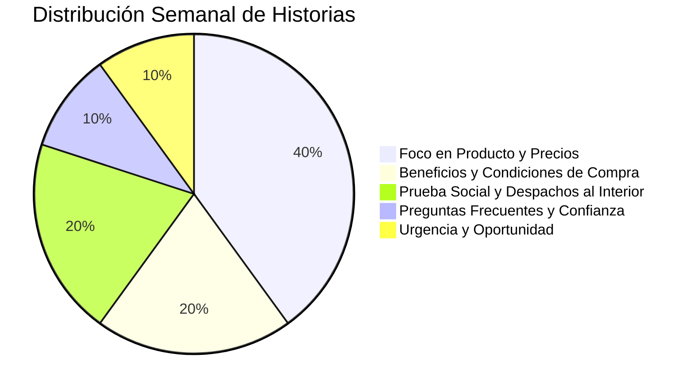

# 📅 Plan Editorial y Estrategia de Historias - SkyBlue Mayorista
**Objetivo**: Generar consultas diarias de revendedoras y locales en WhatsApp (+54 9 11 3891-6779) y mantener las redes con actividad profesional continua.

---

## 🎯 1. Frecuencia y Horarios Recomendados
Para una distribuidora mayorista en Argentina, el comportamiento de compra de revendedoras y dueños de locales se concentra en dos momentos del día:

* **Turno Mañana (11:00 a 12:30 hs)**: Horario de apertura de locales, reposición de mercadería y revisión de listas de precios.
* **Turno Tarde/Noche (18:30 a 20:30 hs)**: Cierre de jornada comercial, tiempo de ocio y navegación en Instagram desde el celular para buscar nuevos proveedores.

> **Ritmo sugerido**: **2 historias por día** (14 a 16 historias semanales / ~60 mensuales).

---

## 🏛️ 2. Los 5 Pilares de Contenido

### Pilar 1: Producto y Catálogo (40% del contenido)
* **Qué se muestra**: Foto o video vertical del producto (carteras, mochilas, calzado XTI/Refresh/Petite Jolie).
* **Datos clave en pantalla**:
  * Marca y Código de artículo.
  * Precio Mayorista transparente.
  * Margen de ganancia sugerido (+100% de rentabilidad).
  * Colores disponibles.
* **CTA**: *"Tocá el enlace y pedí el catálogo completo"*.

### Pilar 2: Condiciones Comerciales (20% del contenido)
* **Objetivo**: Eliminar la barrera de entrada para quien nunca compró al por mayor.
* **Mensajes clave**:
  * *"Mínimo súper accesible: solo 6 unidades surtidas"* (no te obligamos a llevar curvas completas).
  * *"Descuento especial de bienvenida en tu primera compra pagando con transferencia o efectivo"*.
  * *"Armá tu pedido combinando calzado, carteras y mochilas como quieras"*.

### Pilar 3: Prueba Social y Logística Federal (20% del contenido)
* **Objetivo**: Generar confianza total para clientes del interior del país que compran a distancia.
* **Mensajes clave**:
  * Fotos/videos de cajas embaladas saliendo al transporte.
  * *"Despachos diarios por Vía Cargo, Andreani y Expresos a todas las provincias"*.
  * Remitos y comprobantes de seguimiento de envíos.

### Pilar 4: Preguntas Frecuentes / Resolución de Dudas (10% del contenido)
* *"¿Cómo hago mi primer pedido?"* (Explicado en 3 pasos simples).
* *"¿Hacen envíos a mi localidad?"* (Sí, a cualquier punto de Argentina).
* *"¿Tienen local o depósito para retirar?"*

### Pilar 5: Urgencia y Oportunidad (10% del contenido)
* *"Últimas 5 unidades de este modelo"*.
* *"Ingreso de temporada 2026: asegurá tu stock antes del fin de semana"*.

---

## 🗓️ 3. Parrilla Semanal Tipo (Semana 1)

| Día | Historia Mañana (11:30 hs) | Historia Tarde (18:30 hs) |
| :--- | :--- | :--- |
| **Lunes** | **Lanzamiento de Semana**: Cartera/Tote XTI destacada con precio mayorista y margen. | **Condición Comercial**: "Arrancá tu semana con solo 6 unidades surtidas". |
| **Martes** | **Calzado Urbano**: Zapatilla Sneaker Retro Gamuza con detalle de colores. | **Confianza**: "¿Primera vez que comprás? Tenés descuento en tu primera compra". |
| **Miércoles** | **Marroquinería**: Mochila Refresh de tendencia para revendedoras y locales. | **Preguntas Frecuentes**: Paso a paso de cómo hacer el pedido por WhatsApp. |
| **Jueves** | **Logística en Acción**: "Despachos del día saliendo a provincias (Vía Cargo/Expresos)". | **Producto Foco**: Sandalias confort / Calzado fiesta con precio mayorista. |
| **Viernes** | **Urgencia de Fin de Semana**: "Hacé tu pedido hoy antes de las 15 hs para salir en el primer transporte". | **Producto Líquido**: Modelo de alta rotación para stock de fin de semana. |
| **Sábado** | **Encuesta Interesada**: "¿Cuál va mejor para tu vidriera? Modelo A vs Modelo B". | **Recordatorio**: "El catálogo en PDF está disponible en WhatsApp 24/7". |
| **Domingo** | **Planificación Revendedora**: "Prepará tu stock para la semana que entra". | **Lookbook / Tendencia**: Combinación outfit cartera + calzado. |

---

## 🎨 4. Tipos de Creativos que Podemos Generar
1. **Placas de Producto Fijas (1080x1920)**: Las que ya generamos con nuestro script automatizado (alta definición, diseño moderno y limpio).
2. **Videos / Animaciones Cortas (9:16 de 10 a 15s)**: Mini clips animados mostrando el producto o unboxing.
3. **Fotos Reales de Depósito**: Fotos tomadas con el celular en el depósito de cajas listas para enviar (las más vendedoras para generar confianza).
